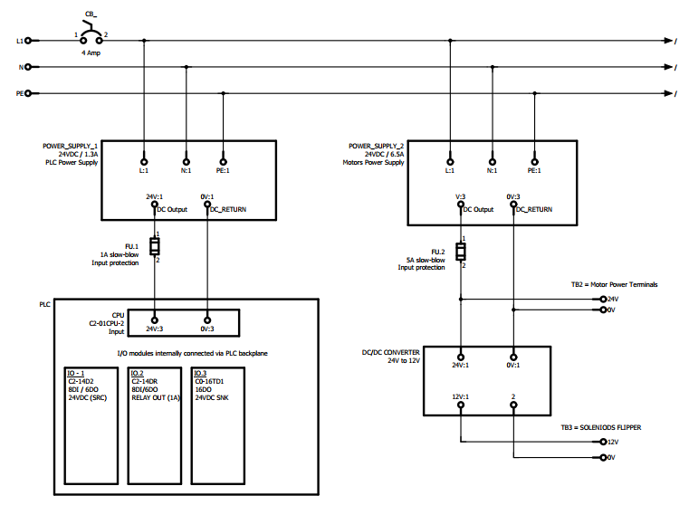
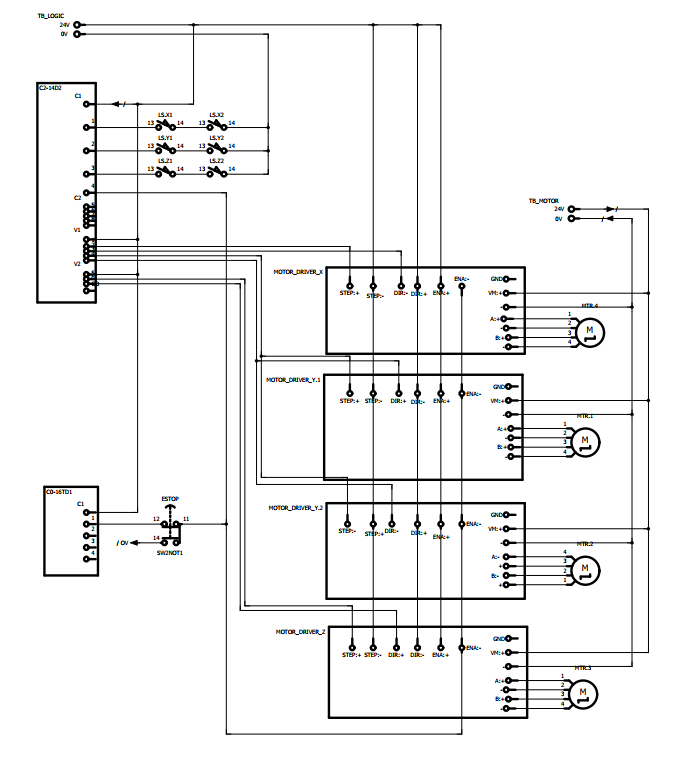
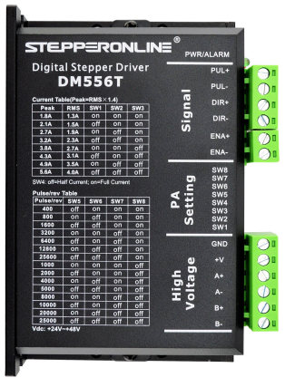
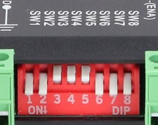
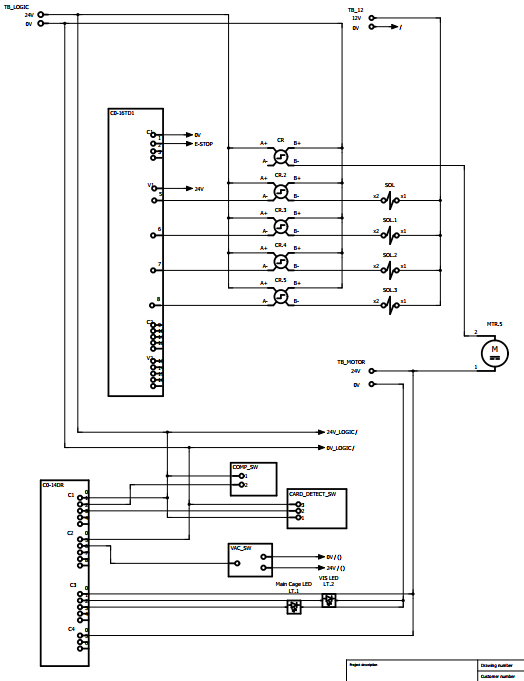

# Electrical Overview
The electrical system consists of three main subsystems:
1. **Power Distribution System** - Multi-voltage power supply and protection circuits
2. **Motor Control System** - Stepper motor drivers and motion control
3. **Pneumatic Control System** - Solenoid valves and air pressure management

---

# 1. Power Distribution Schematic

  

## Power Supply Units
| Supply Unit | Input | Output | Current | Application |
|:------------|:------|:-------|:--------|:------------|
| **POWER_SUPPLY_1** | 240VAC / 1.3A | 24VDC | PLC rated | PLC and I/O modules |
| **POWER_SUPPLY_2** | 240VAC / 8.5A | 24VDC | Motors rated | Motor drivers |
| **DC/DC CONVERTER** | 24VDC | 12VDC | TBD | Solenoids/Accessories |

## Terminal Blocks
| Terminal Block | Voltage | Usage |
|:---------------|:--------|:------|
| **TB_Logic** | +24V / 0V | PLC I/O Power Terminals |
| **TB_Motor** | +24V / 0V | Motor Power Terminals |
| **TB3** | +12V / 0V | Solenoids Flipper |

---

# 2. Motor Control Schematic

  

| Component | Description | Specifications |
|:----------|:------------|:---------------|
| **C2-14DR** | I/O module | Relay output |
| **Motors** | Stepper motors for each axis | X, Y1, Y2, Z-axis |
| **Motor Driver** | Stepper motor driver (x4) | Translates electrical pulses into motor actuation |
| **Limit Switch** | Feedback sensor to signal axis limits | Two switches per axis |
| **ESTOP** | Emergency stop button | Normally closed circuit |

## Motor Driver Reference
| Motor Driver Pinout | Driver Config |
|:--------------------|:--------------|
|  |  |

### Signal Pins
| Pin | Function | Description |
|:----|:---------|:-----------|
| **PUL+** | Step signal positive | Receives pulse train from PLC/controller - each pulse advances motor by one microstep |
| **PUL-** | Step signal ground | Ground reference for step signal (differential pair with PUL+) |
| **DIR+** | Direction signal positive | Sets rotation direction: HIGH = clockwise, LOW = counter-clockwise |
| **DIR-** | Direction signal ground | Ground reference for direction signal (differential pair with DIR+) |
| **ENA+** | Enable signal positive | Motor enable control: LOW = motor energized and holding, HIGH = motor disabled/free |
| **ENA-** | Enable signal ground | Ground reference for enable signal (differential pair with ENA+) |

### High Voltage Pins
| Pin | Function | Description |
|:----|:---------|:-----------|
| **GND** | Power ground | Common ground reference for driver electronics |
| **VEL+** | Velocity feedback positive | Optional encoder feedback signal for closed-loop control |
| **VEL-** | Velocity feedback ground | Optional encoder feedback signal (ground/negative) |
| **A+ / A-** | Motor coil A | Phase A winding connections to stepper motor (bipolar) |
| **B+ / B-** | Motor coil B | Phase B winding connections to stepper motor (bipolar) |

---

# 3. Pneumatic Control Schematic

| Component | Description | Function |
|:----------|:------------|:---------|
| **C0-16TD1** | I/O Combo module | 24V DC for solenoid control |
| **C2-14DR** | I/O Combo module | Relay output control |
| **SOL1-4** | 5/2 solenoid valves | Double-acting pneumatic control |
| **Pressure Switch** | Air pressure sensor | Monitors system pressure |
| **Flipper Motor** | Tilt mechanism motor | 24V DC motor |
| **LED Strip** | Status indicator | Provide diffused lighting for machine vision |

---