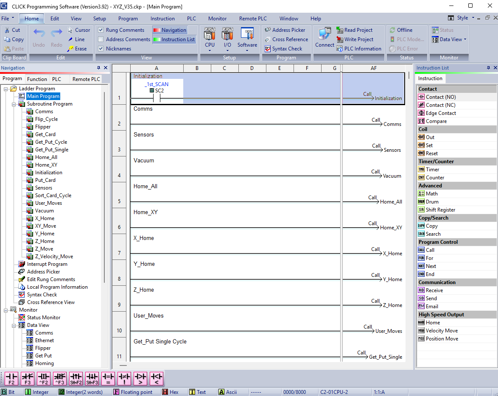

# PLC Control System Overview

  
  
<em>CLICK PLC Programming Software Interface</em>

The Programmable Logic Controller (PLC) serves as the central control unit of the Card Sorting System. It manages motion control, sequencing, sensor integration, and communication with external systems to ensure reliable and coordinated operation.

---
## System Configuration

| Category              | Details                          |
|----------------------|----------------------------------|
| Programming Software | CLICK PLC Programming Software   |
| Language Used        | Ladder Logic                     |
| Total I/O            | 26 (Inputs = 9 / Outputs = 17)                            |
| Communication        | Modbus TCP                       |
| Features Used        | Timers, counters, indexing, function calls |

---

## Input Signals

| Address | Tag Name              | Description                                      |
|---------|----------------------|--------------------------------------------------|
| X001    | X_Lmt                | X-axis limit switches (positive & negative, parallel) |
| X002    | Y_Lmt                | Y-axis limit switches (positive & negative, parallel) |
| X003    | Z_LmtPos             | Z-axis positive limit switch                     |
| X004    | Motor_Enable_FB      | Motor driver enable feedback                     |
| X005    | Flipper_LSW_Normal   | Flipper in normal position                       |
| X006    | Flipper_LSW_Flipped  | Flipper in flipped position                      |
| X021    | Tool_Compression     | Z-axis negative limit switch         |
| X022    | Tool_Card_Detect     | Photoelectric sensor                          |
| X025    | Vacuum_Ok            | Vacuum pressure switch                               |
---

## Output Signals

| Address   | Tag Name          | Description                                                       |
| --------- | ----------------- | ----------------------------------------------------------------- |
| Y001–Y003 | X/Y/Z Step Pulse  | Sends step pulses to drive motion on X, Y, and Z axes             |
| Y004–Y006 | X/Y/Z Direction   | Sets motion direction for X, Y, and Z axes                        |
| Y026      | Main_Cage_LED     | Indicates overall system status                                   |
| Y101      | Motor_Disable     | Disables motor output (locks motor in place)                      |
| Y102      | Vision_LED        | Provides controlled illumination for the camera                   |
| Y104      | Vacuum_Pump       | Activates the vacuum pump                                         |
| Y105      | Tool_Vacuum       | Energizes solenoid to enable suction at the tool                  |
| Y106      | Tool_Release      | De-energizes/redirects solenoid to release suction at the tool    |
| Y107      | Flipper_Vacuum    | Energizes solenoid to enable suction at the flipper               |
| Y108      | Flipper_Release   | De-energizes/redirects solenoid to release suction at the flipper |
| Y113      | Flipper_RUN       | Enables flipper motor operation                                   |
| Y114–Y115 | Flipper_FWD / REV | Controls flipper motor direction (forward/reverse)                |

---

## Program Sequence

<table>
  <tr>
    <td align="center"><strong>Initialization</strong></td>
    <td align="center"><strong>Sort Ranks</strong></td>
  </tr>
  <tr>
    <td align="center">
      
    </td>
    <td align="center">
      
    </td>
  </tr>
</table>