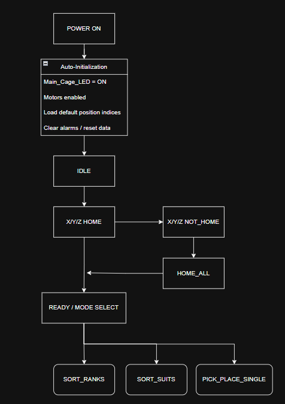
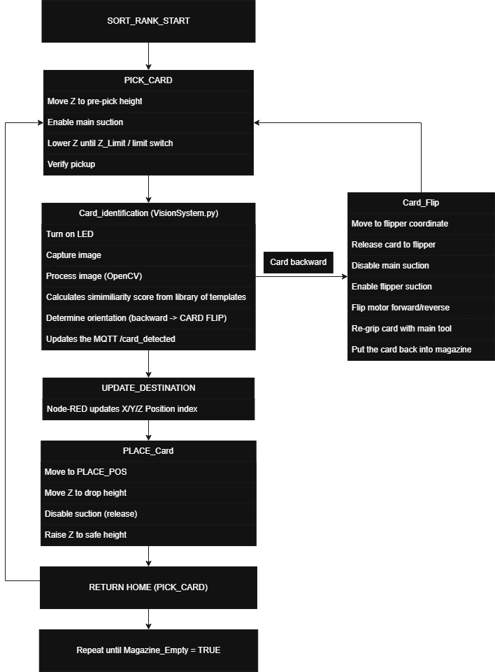

# PLC Control System Overview

The Programmable Logic Controller (PLC) serves as the central control unit of the Card Sorting System. It manages motion control, sequencing, sensor integration, and communication with external systems to ensure reliable and coordinated operation.

---
## System Configuration

| Category              | Details                          |
|----------------------|----------------------------------|
| Programming Software | CLICK PLC Programming Software   |
| Language Used        | Ladder Logic                     |
| Total I/O            | 26 (Inputs = 9 / Outputs = 17)                            |
| Communication        | Modbus TCP                       |
| Features Used        | Timers, counters, indexing, function calls |

---

## Input Signals

| Address | Tag Name                  | Description                          |
|---------|---------------------------|--------------------------------------|
| X001    | X_LmtNeg                  | X-axis negative limit switch         |
| X002    | Y_LmtNeg                  | Y-axis negative limit switch         |
| X003    | Z_LmtPos                  | Z-axis positive limit switch         |
| X004    | Motor_Enable_Feedback     | Motor driver enable feedback         |
| X005    | Flipper_LSW_Normal        | Flipper normal position              |
| X006    | Flipper_LSW_Flipped       | Flipper flipped position             |
| X021    | Tool_Compression          | Tool compression (card contact)      |
| X022    | Tool_Card_Detect          | Card presence detection              |
| X025    | Vacuum_Ok                 | Vacuum pressure confirmation         |
---

## Output Signals

| Address     | Tag Name                        | Description                                      |
|-------------|--------------------------------|--------------------------------------------------|
| Y001–Y006   | X/Y/Z Pulse & Direction        | Stepper motor control (X, Y, Z axes)             |
| Y026        | Main_Cage_LED                  | System status lighting                           |
| Y101        | Motor_Disable                  | Motor disable control                            |
| Y102        | Vision_LED                     | Camera illumination                              |
| Y104        | Vacuum_Pump                    | Vacuum pump activation                           |
| Y105–Y108   | Vacuum / Solenoid Control      | Tool & flipper suction / release control         |
| Y113        | Flipper_RUN                    | Flipper motor enable                             |
| Y114–Y115   | Flipper_FWD / REV              | Flipper direction control                        |

---

## Program Sequence

<table>
  <tr>
    <td align="center"><strong>Initialization</strong></td>
    <td align="center"><strong>Sort Ranks</strong></td>
  </tr>
  <tr>
    <td align="center">
      
    </td>
    <td align="center">
      
    </td>
  </tr>
</table>