# Bill of Materials (BOM)

[← Back to Main README](README.md)

Complete parts list for the Mechatronics Card Sorting System - **Project 2221**

---

## 3-Axis Gantry

| Part | Qty | Price | Summary | Pic | Links |
|:----:|:---:|:-----:|:-------:|:---:|:-----:|
| **CNC Machine** | 1 | $469.99 | 3-Axis Wood Engraving Milling Machine, 300W Spindle, 15.75" x 15.75" x 2.36" Working Area, Aluminum Alloy Structure, Offline Controller included | 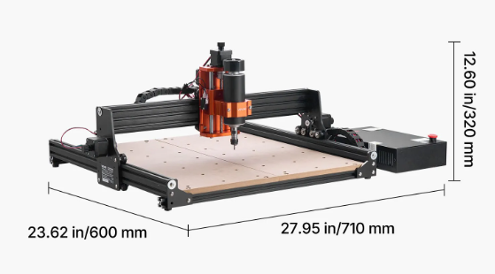 | [Purchase](https://www.vevor.ca/) |
| **Stepper Driver** | 4 | $29.99 | Digital Microstep Driver, 2-Phase 5.6A for NEMA23/34, 24-50V supply, 8-level adjustable current 1.0-5.6A, Optical isolation, 200kHz pulse response | 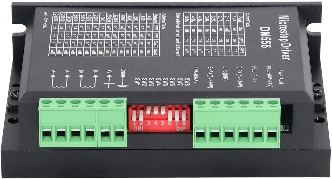 | [Datasheet](https://www.omc-stepperonline.com/download/DM556T.pdf) · [Purchase](https://www.amazon.ca/dp/B0CS3XBN2X) |
| **Aluminum Profile** | 1 (2pcs) | $47.99 | 2040 Profile (20×40mm), 800mm length, 6063 Aluminum anodized black, 6.2mm slot | 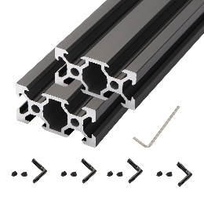 | [Purchase](https://www.amazon.ca/dp/B0BZ54QQPG) |
| **Cable Drag Chain** | 2 | $13.99 | R28/38, 15×30mm inner, 1m length, Semi-enclosed with connectors, Black plastic | 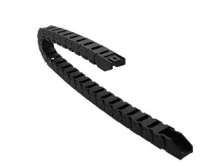 | [Purchase](https://www.amazon.ca/dp/B07QZR6GMT) |

---

## PLC System

| Part | Qty | Price | Summary | Pic | Links |
|:----:|:---:|:-----:|:-------:|:---:|:-----:|
| **Power Supply** | 1 | $73.00 | CLICK AC power supply, 100-240 VAC input, 24 VDC nominal output, 1.3A continuous | 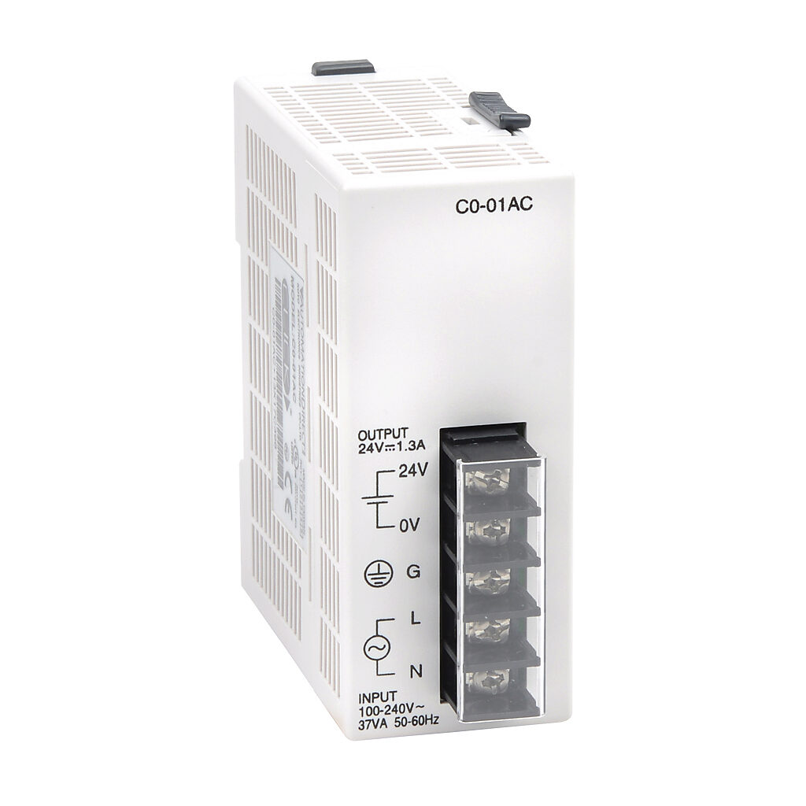 | [Datasheet](https://www.automationdirect.com/) · [Purchase](https://www.automationdirect.com/adc/shopping/catalog/programmable_controllers/click_plus_plcs_(stackable_micro_modular)/power_supplies/c0-01ac) |
| **PLC CPU** | 1 | $207.90 | CLICK PLUS PLC, 24 VDC, (2) option slots, Ethernet, Serial, MicroB-USB ports, Battery backup, No on-board I/O | 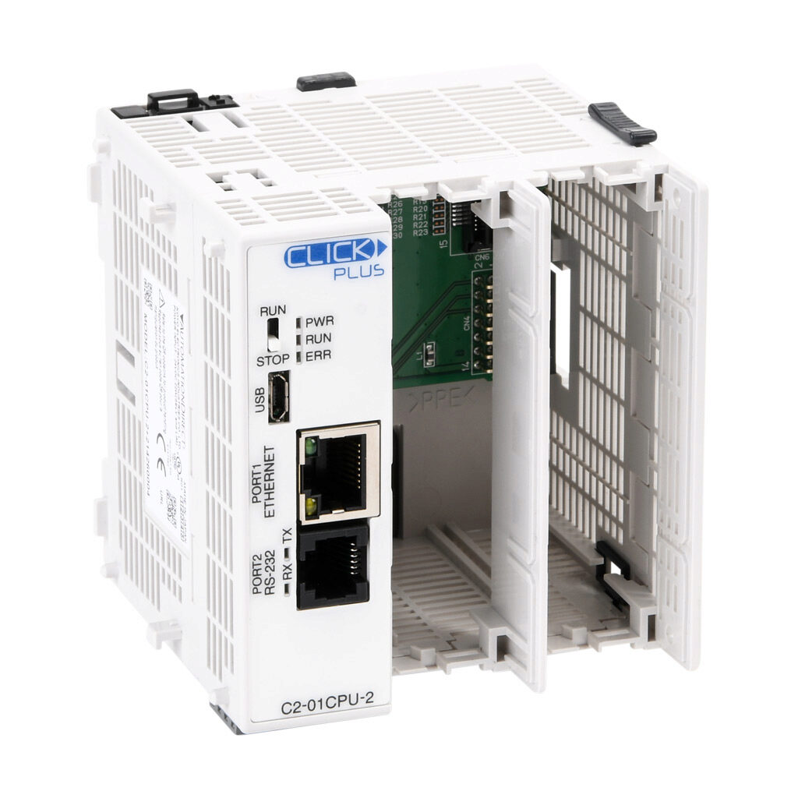 | [Datasheet](https://www.automationdirect.com/) · [Purchase](https://www.automationdirect.com/adc/shopping/catalog/programmable_controllers/click_plus_plcs_(stackable_micro_modular)/cpus/c2-01cpu-2) |
| **I/O Combo Module** | 1 | $89.10 | Discrete combo: Input 8-pt 24VDC sink/source, Output 6-pt 24VDC sourcing 0.1A/point, Removable terminal | 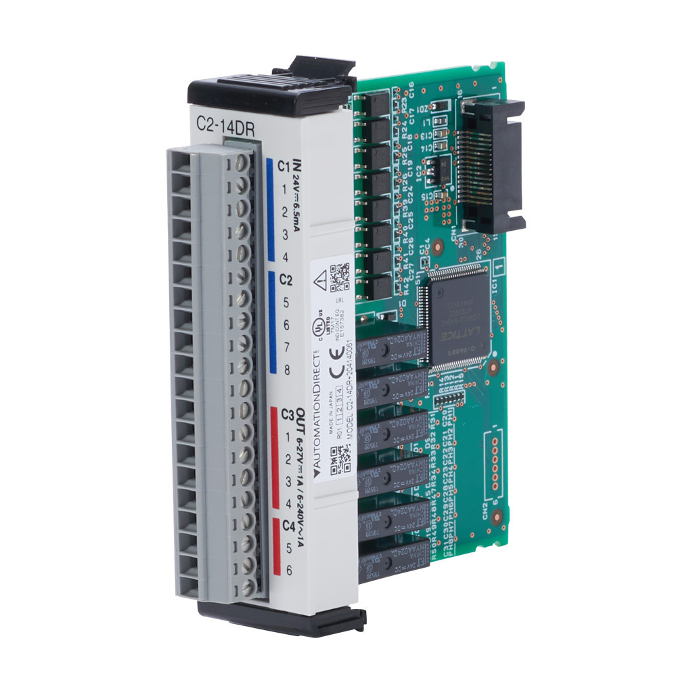 | [Datasheet](https://www.automationdirect.com/) · [Purchase](https://www.automationdirect.com/adc/shopping/catalog/programmable_controllers/click_plus_plcs_(stackable_micro_modular)/cpu_option_slot_modules/c2-14d2) |
| **I/O Combo Module** | 1 | $102.60 | Discrete combo: Input 8-pt 24VDC sink/source, Output 6-pt Relay 1A/point (6-240VAC/6-27VDC), Removable terminal | 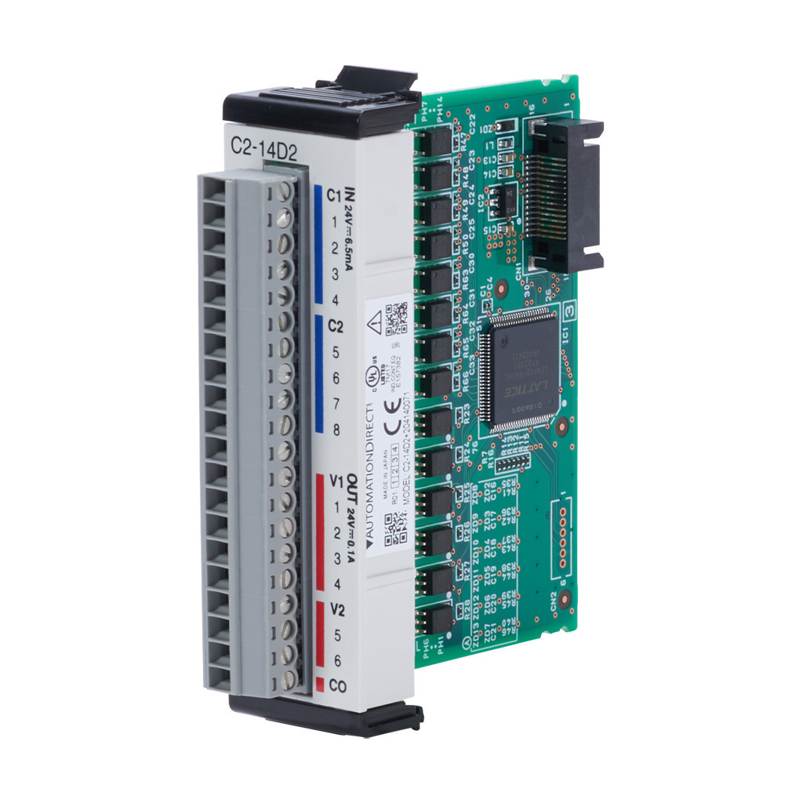 | [Datasheet](https://www.automationdirect.com/) · [Purchase](https://www.automationdirect.com/adc/shopping/catalog/programmable_controllers/click_plus_plcs_(stackable_micro_modular)/cpu_option_slot_modules/c2-14dr) |
| **Output Module** | 1 | $94.50 | 16-pt discrete output, 5-27VDC sinking, 2 isolated commons, 8 pts/common, 0.1A/point | 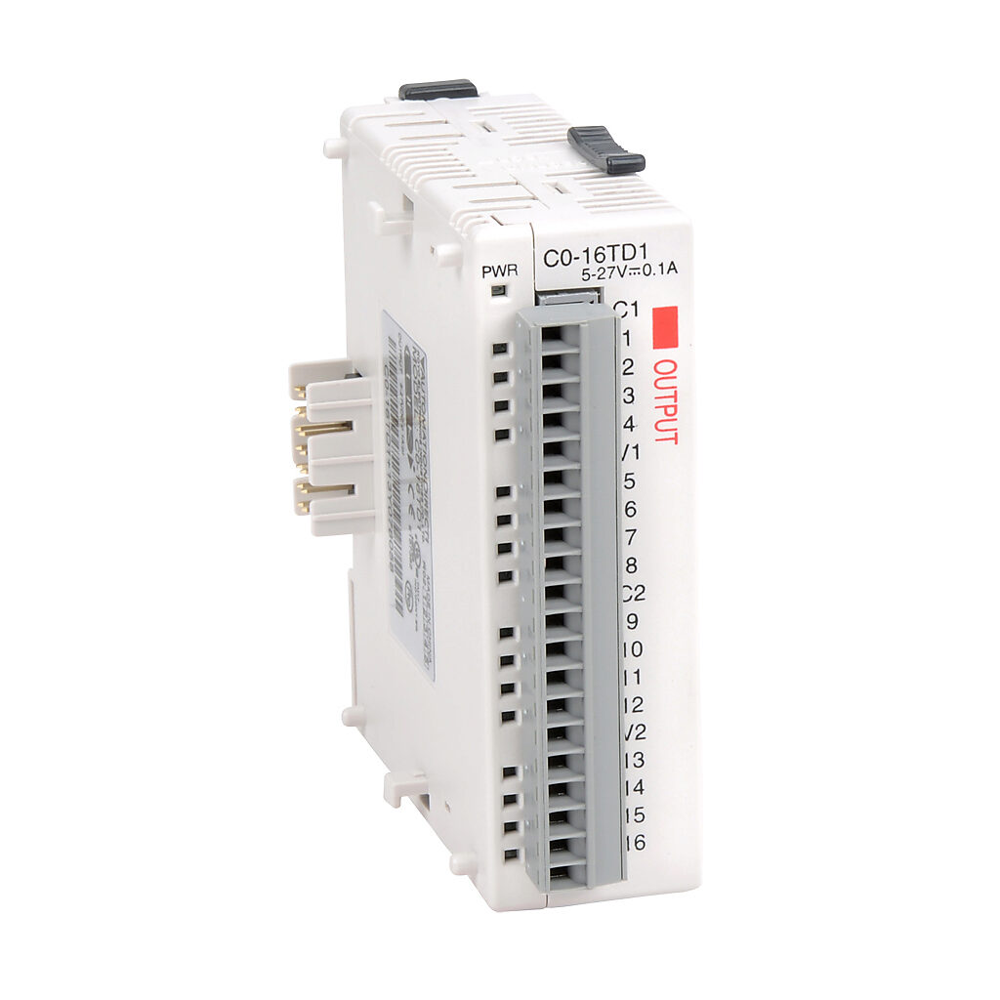 | [Datasheet](https://www.automationdirect.com/) · [Purchase](https://www.automationdirect.com/adc/shopping/catalog/programmable_controllers/click_plus_plcs_(stackable_micro_modular)/stackable_i-z-o_modules/c0-16td1) |
| **35mm DIN Rail** | 1 | $14.95 | 7.5×35mm, 1 meter, Part# 58-415-0 | 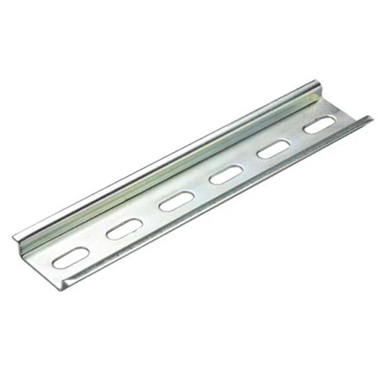 | [Purchase](https://shop.sayal.com/products/ker-101) |

---

## Vision System

| Part | Qty | Price | Summary | Pic | Links |
|:----:|:---:|:-----:|:-------:|:---:|:-----:|
| **USB Camera** | 1 | $28.35 | 1080P@30fps USB2.0 UVC Camera, YUY2/MJPEG format, FOV 130°(D)/103°(H), M12 lens mount, Indoor/Outdoor rated | 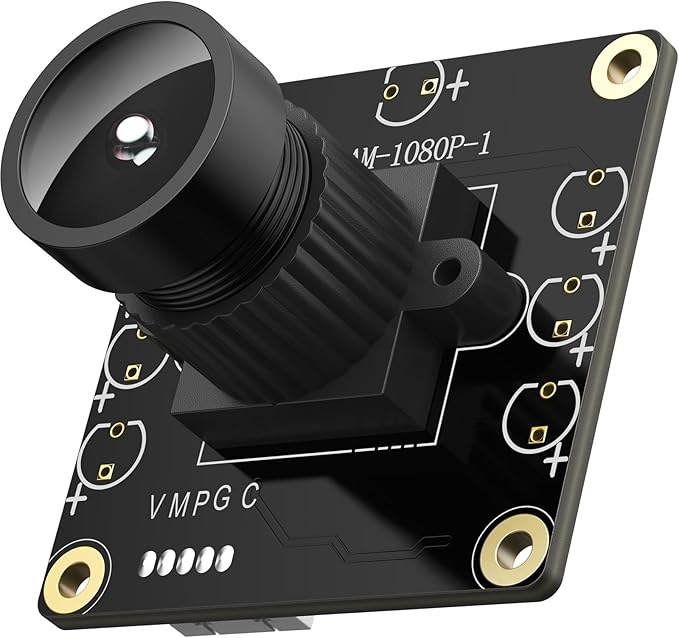 | [Purchase](https://www.amazon.ca/dp/B0CNCSFQC1) |
| **6mm Wide Angle Lens** | 1 | $13.99 | uxcell 3MP F2.0 CCTV Camera Lens, 6mm focal length, M12 threaded, Black, For IP cameras | 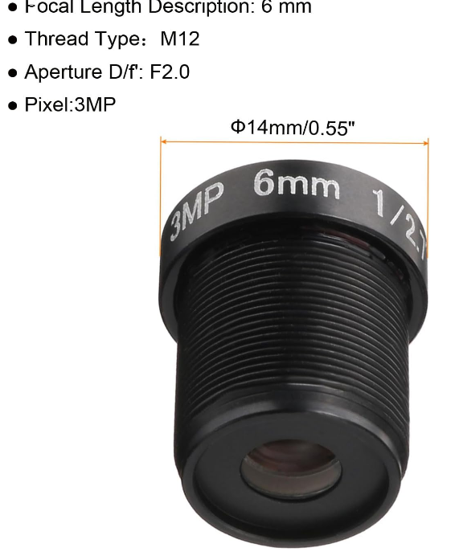 | [Purchase](https://www.amazon.ca/dp/B0CWRYQGZY) |
| **USB Exntension Cable** | 1 | $11.50 | Programming cable, USB A to MicroB-USB, 15ft, For Productivity PLCs and USB devices | 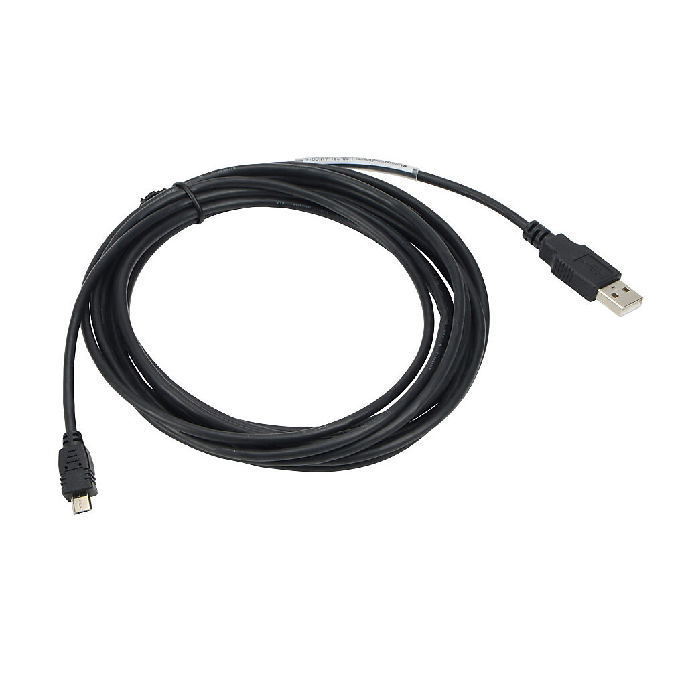 | [Purchase](https://www.automationdirect.com/adc/shopping/catalog/cables_(terminated)/plc_cables/usb-cbl-amicb15) |
| **COB LED Strip** | 1 | $25.99 | FCOB 24V Cool White 6000K, 5m length, 480 LEDs/m, 8mm width, Dimmable | 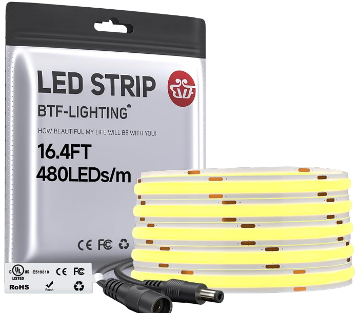 | [Purchase](https://www.amazon.ca/dp/B0F83XN79B) |

---

## Pneumatics & Vacuum Operation

| Part | Qty | Price | Summary | Pic | Links |
|:----:|:---:|:-----:|:-------:|:---:|:-----:|
| **Diaphragm  Vacuum Pump** | 1 | $33.52 | 24V 0.4-1L/min Miniature Diaphragm Pump for Air/Liquid, Compact design for vacuum generation | 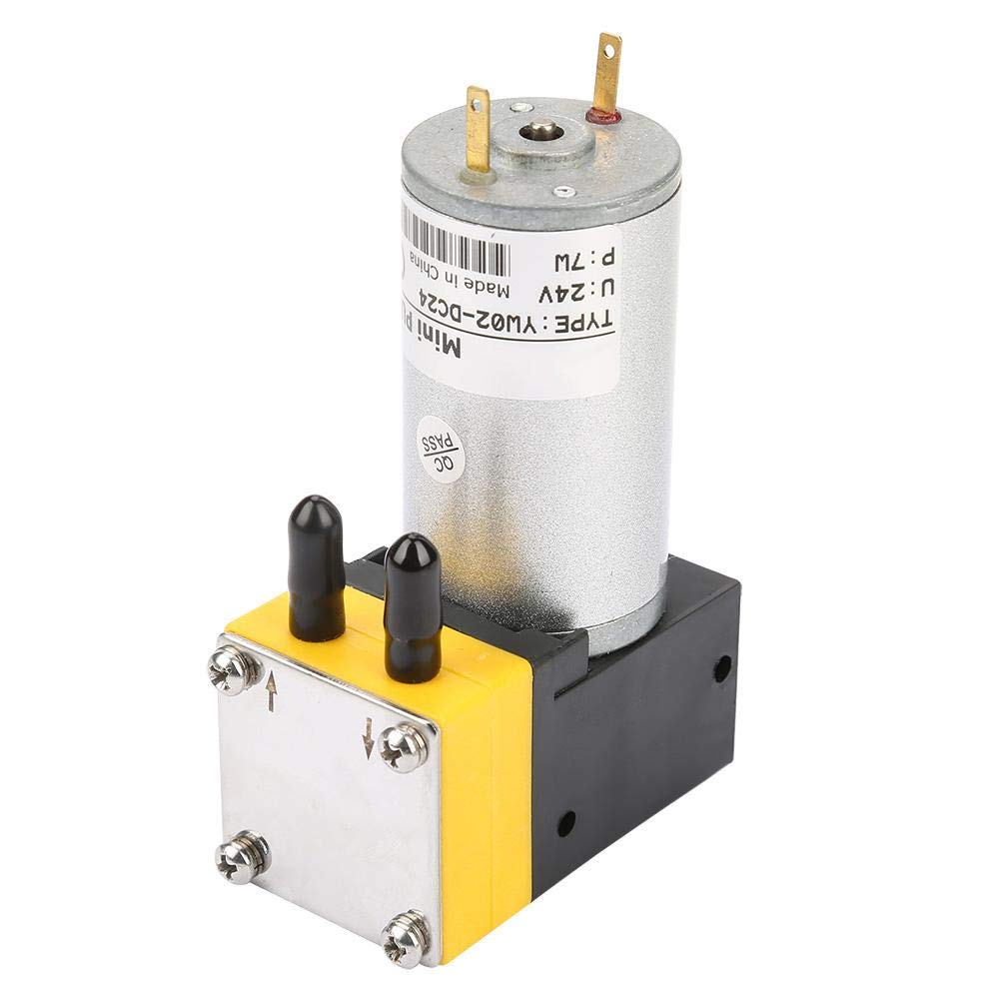 | [Purchase](https://www.amazon.ca/dp/B07T5BXDHP) |
| **ZSE30 Vacuum Pressure Switch** | 1 | $43.99 | Digital Pressure Switch, 12-24VDC, 0 to -101kPa range, 1 PNP output, G1/8 port | 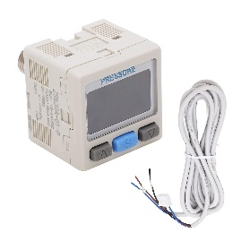 | [Datasheet](https://www.amazon.ca/dp/B0CNDFQQ4J) · [Purchase](https://www.amazon.ca/dp/B0CNDFQQ4J) |
| **Solenoid Valve  2-Way NC** | 4 | $22.99 | 12V DC 1/4" Aluminum, 2-Way Normally Closed, Quick switching, Excellent sealing for water/gas | 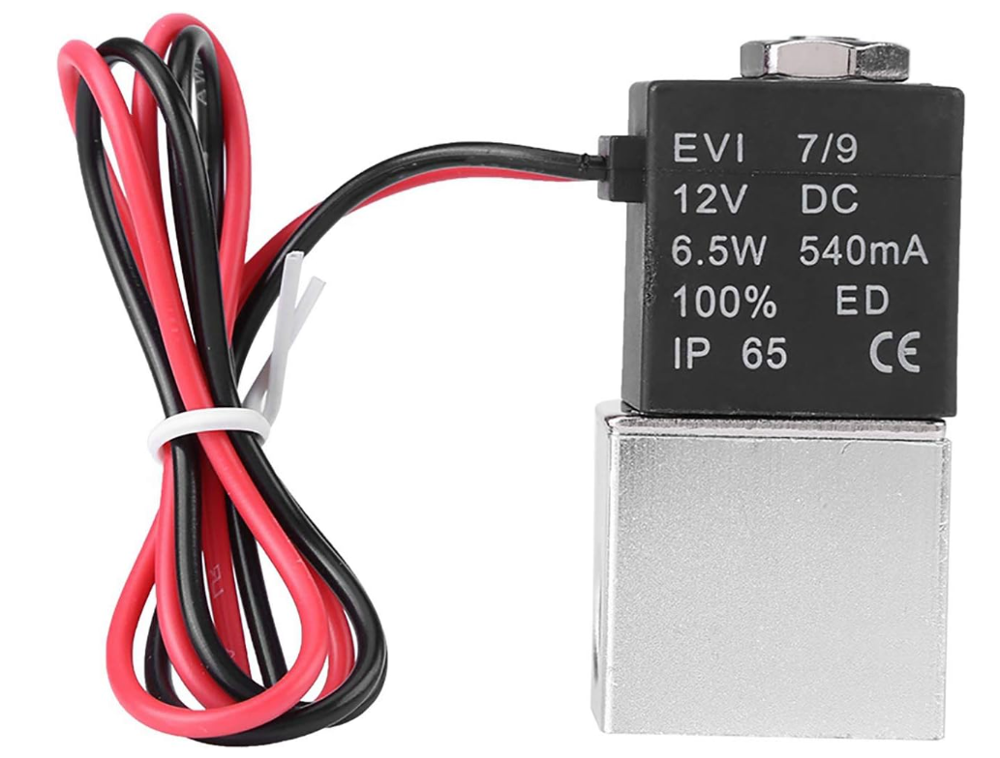 | [Purchase](https://www.amazon.ca/dp/B0D7SZ6BB6) |
| **Suction Cup 20mm** | 1 (4pcs) | $15.39 | uxcell Bellows Suction Cup, 20mm Diameter × M5 Joint, Silicone, Clear White | 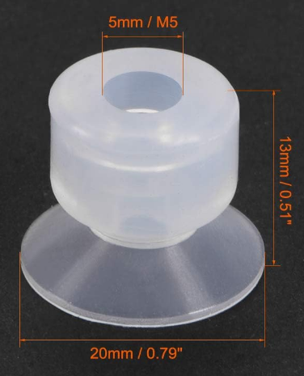 | [Purchase](https://www.amazon.ca/dp/B07MB8NHSH) |
| **Suction Cup 30mm** | 1 (4pcs) | $16.99 | uxcell Bellows Suction Cup, 30mm Diameter × M5 Joint, Silicone, Clear White | 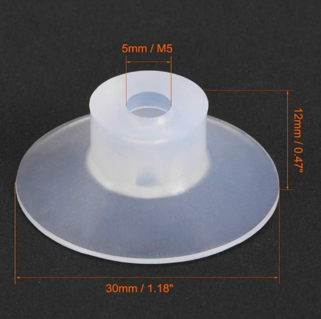 | [Purchase](https://www.amazon.ca/dp/B07MHGDXKD) |
| **One-Way Check Valve** | 1 (5pcs) | $13.09 | 1/8" (3mm) PP Non-Return Check Valve, 30.6×14.9mm, For water/fuel/oil/air | 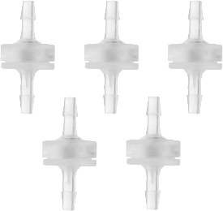 | [Purchase](https://www.amazon.ca/dp/B0DNP2Z4PC) |
| **DC Gear Motor** | 1 | $11.59 | DMiotech 6V 30RPM, Rated Torque 12, 10mm output shaft, Speed reduction motor | 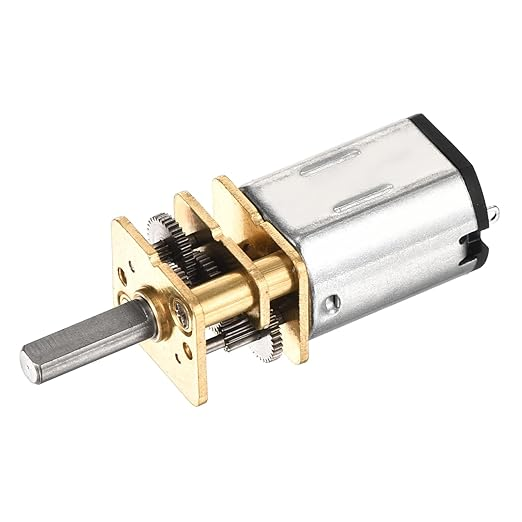 | [Purchase](https://www.amazon.ca/) |
| **Silicone Tubing** | 3m | $16.99 | 5mm ID × 7mm OD, Translucent, Silicone rubber, For water/air | 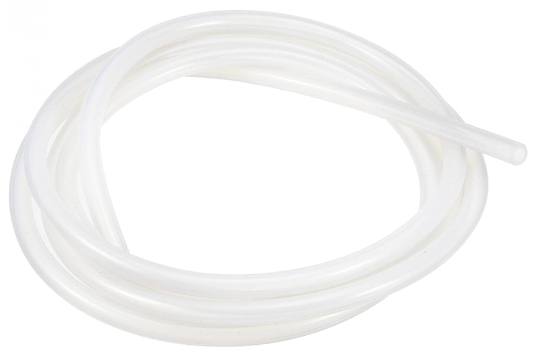 | [Purchase](https://www.amazon.ca/dp/B01N918LAU) |
| **Brass Tube** | 1 (3pcs) | $16.69 | 5mm OD, 0.5mm wall, 300mm length, Seamless | 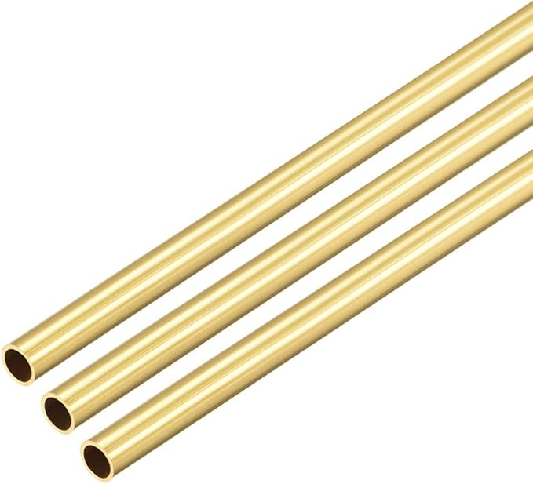 | [Purchase](https://www.amazon.ca/dp/B07Z9BHSY8) |
| **Bulkhead Fitting** | 1 (2pcs) | $17.99 | 1/4" NPT F to F, Brass, 1.5" length | 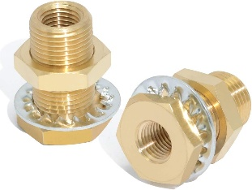 | [Purchase](https://www.amazon.ca/dp/B07D6NZLXF) |
| **Brass Male Reducer** | 1 (5pcs) | $9.99 | 1/4" NPT M to M | 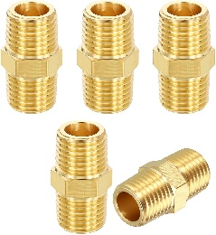 | [Purchase](https://www.amazon.ca/dp/B0FB8CC665) |
| **BSP to NPT Adapter** | 1 | $17.85 | 1/8" F BSP to 1/4" M NPT, Solid brass, CNC machined | 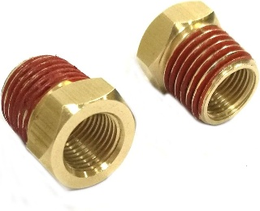 | [Purchase](https://www.amazon.ca/) |

---

## Power / Electrical Components

| Part | Qty | Price | Summary | Pic | Links |
|:----:|:---:|:-----:|:-------:|:---:|:-----:|
| **LRS-200-36  Power Supply** | 1 | $37.53 | Mean Well Enclosed AC-DC Converter, 36V output, 90-132/180-264 VAC input, 240-370 VDC input | 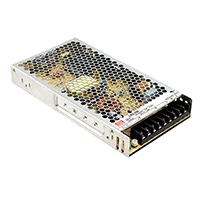 | [Datasheet](https://www.digikey.ca/) · [Purchase](https://www.digikey.ca/en/products/detail/mean-well-usa-inc/LRS-200-36/7705024) |
| **LRS-150F-24  Power Supply** | 1 | $30.00 | Mean Well 24V 6.5A 156W, Single Output Switching Power Supply | 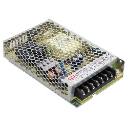 | [Datasheet](https://www.meanwell.com/) · [Purchase](https://www.amazon.ca/dp/B018RE4DQ2) |
| **DIN Rail  Relay SPDT** | 5 | $27.00 | Phoenix Contact General Purpose SPDT, 6A 24V, DIN rail mount | 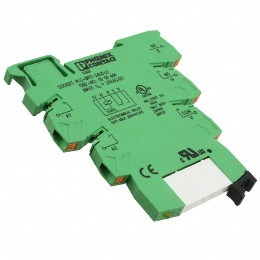 | [Datasheet](https://www.phoenixcontact.com/) · [Purchase](https://www.digikey.ca/en/products/detail/phoenix-contact/2900300/2742133) |
| **Terminal Block** | 30 | $2.50 | Weidmüller Feed-Through, 12-30 AWG, DIN rail mount | 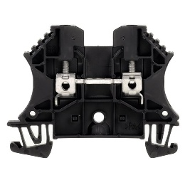 | [Datasheet](https://www.weidmuller.com/) · [Purchase](https://www.digikey.ca/en/products/detail/weidm%C3%BCller/1020010000/412674) |
| **Emergency Stop Button** | 1 | $14.99 | 660V 10A AC, Latching with weatherproof box, Twist-release, Instant power cutoff | 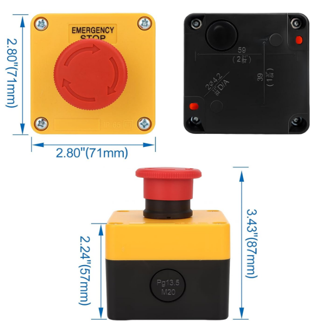 | [Purchase](https://www.amazon.ca/dp/B00NTT91Y0) |
| **Wire Duct 35×25mm** | 1 | $14.95 | HVDR2540F-2M, Slotted 1"×1.5"×78", 4mm slot, Grey | 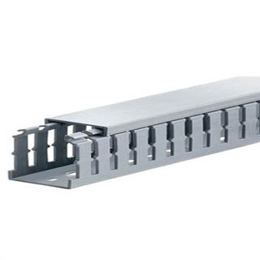 | [Purchase](https://shop.sayal.com/products/kfc-2418b) |

---

## Sensors & Switches

| Part | Qty | Price | Summary | Pic | Links |
|:----:|:---:|:-----:|:-------:|:---:|:-----:|
| **Photoelectric Sensor** | 1 | $19.77 | E3Z-D61 Type, 12-24VDC NPN, Diffuse Reflection Infrared, 100mm detection range, 1.9m cable | 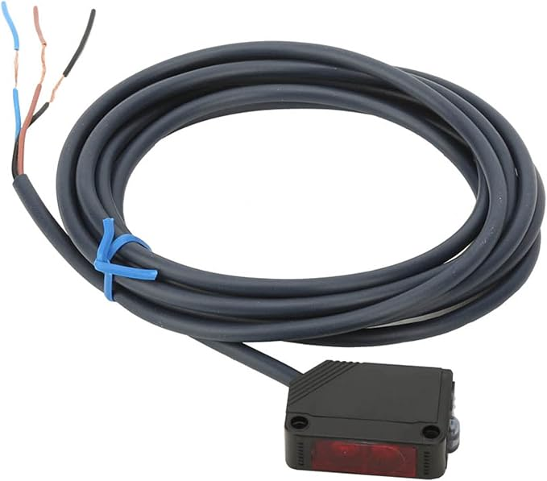 | [Datasheet (Similar)](https://www.amazon.ca/) · [Purchase](https://www.amazon.ca/dp/B083FQYLJD) |
| **Limit Switch** | 1 | $3.33 | Omron Mechanical Limit Switch | 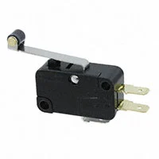 | [Datasheet](https://www.omron.com/) · [Purchase](https://www.digikey.com/en/products/detail/omron-electronics-inc-emc-div/V-156-1C25/5237043) |
| **Optical Endstop** | 1 (6pcs) | $18.99 | Optical Limit Switch Module, 1m cable, Sensitive/quiet, High repeatability, No mechanical collision | 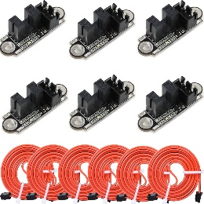 | [Purchase](https://www.amazon.ca/dp/B09BQ8SNMK) |

---

## Miscellaneous

| Part | Qty | Price | Summary | Pic | Links |
|:----:|:---:|:-----:|:-------:|:---:|:-----:|
| **Playing Cards** | 1 (2 deck) | $24.98 | WES Bridge Cards, Matte finish, Premium plastic, Standard index | 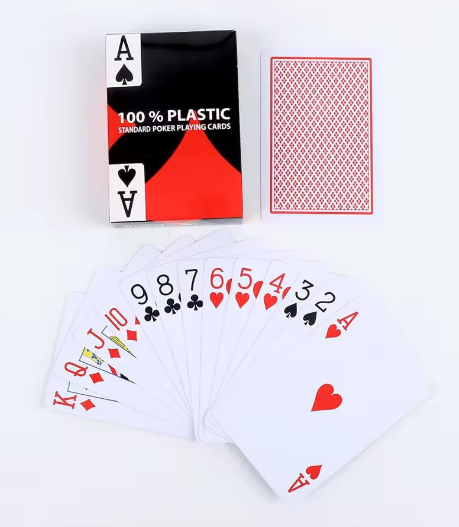 | [Purchase](https://www.amazon.ca/dp/B0DD2PMKMS) |
| **PLA Filament** | 4 | $29.99 | Creality RFID, 1.75mm, 1kg/spool, High speed 30-600mm/s compatible | 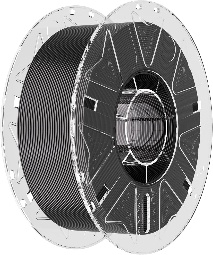 | [Purchase](https://www.amazon.ca/dp/B0DHXDRZ74) |
| **Super Glue** | 1 | $18.29 | Medium viscosity cyanoacrylate, 2610 PSI, 4.6oz, Multi-purpose | 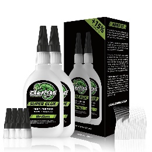 | [Purchase](https://www.amazon.ca/dp/B0DMP3QWD3) |
| **MDF Board 1/2"** | 1 | $45.00 | 4ft × 8ft × 1/2" MDF Panel | 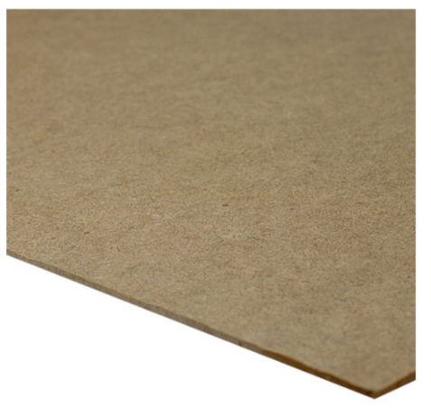 | [Purchase](https://www.rona.ca/en/product/1-2-in-x-49-in-x-97-in-mdf-panel-bm003054-49585308) |
| **Magnets** | 1 (100pcs) | $16.99 | 6×3mm Neodymium, Brushed nickel finish | 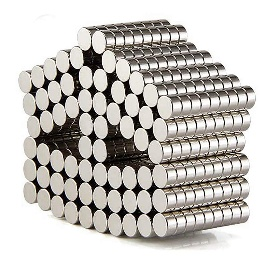 | [Purchase](https://www.amazon.ca/dp/B07WCN5FGD) |
| **Stainless Steel Rods** | 1 | $9.29 | 304 SS, 3mm diameter, 200mm length, Silver | 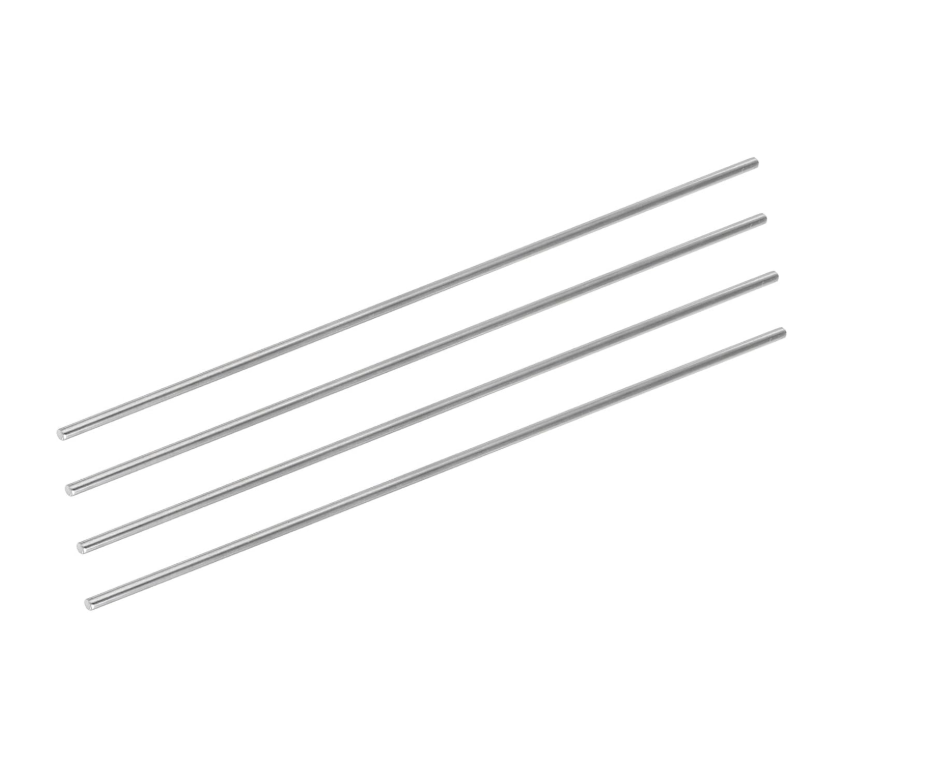 | [Purchase](https://www.amazon.ca/dp/B0CD2GZ97T) |
| **Flanged Couplers 3mm** | 1 | $11.99 | 3mm ID, High hardness metal, With L-wrench and locking screws | 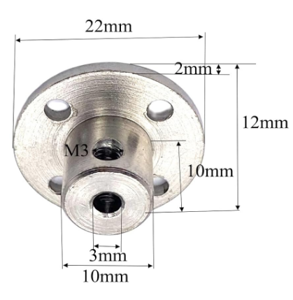 | [Purchase](https://www.amazon.ca/dp/B0DZXQ9RZH) |
| **Compression Springs** | 1 | $19.99 | 300pcs, 30 sizes, Stainless steel, Good fatigue strength | 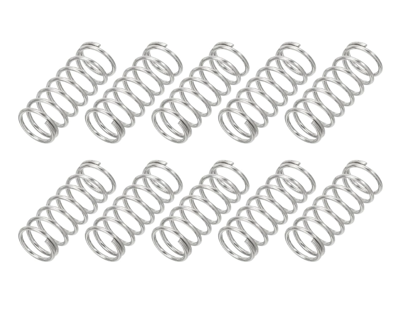 | [Purchase](https://www.amazon.ca/) |
| **Corner Bracket** | 1 | $22.00 | 20× Corner Brackets + 40× M5 T-Nuts + 40× M5×10mm Screws, Cast aluminum/galvanized steel | 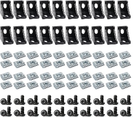 | [Purchase](https://www.amazon.ca/dp/B0855V2JV3) |
| **Corner Bracket Cubes** | 2 | $36.99 | 8pcs Black 20×20×20mm cubes for 2020 series, 6mm slot | 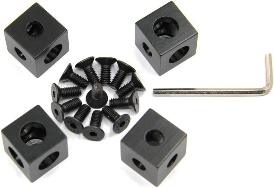 | [Purchase](https://www.amazon.ca/dp/B08Z3GRQCW) |
| **Wire Miscellaneous** | 1 | $100.00 | Power and signal wire, various gauges | - | - |
| **Screws/Nuts/Washers** | 1 | $30.00 | Various sizes and types | - | - |
---

## 🔗 Quick Links

- [← Back to Main README](README.md)
- [Hardware Assembly Guide](HARDWARE.md)
- [Installation Guide](INSTALLATION.md)