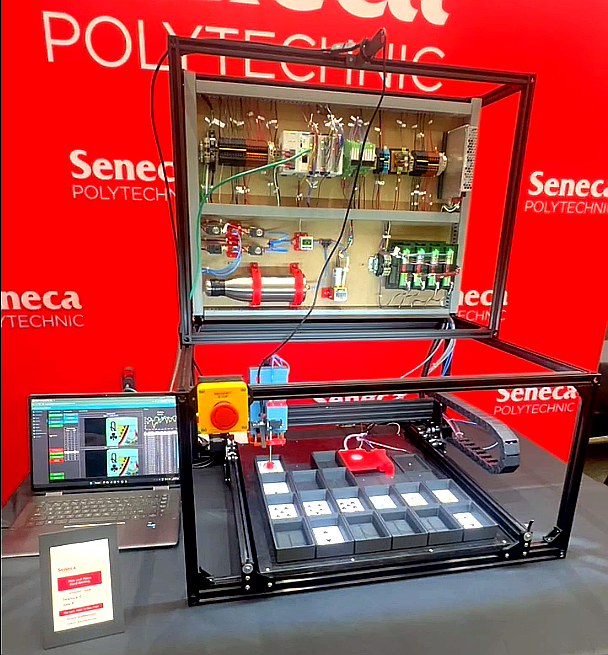

# Mechatronics Card Sorting System

  
  
<em>Final showcase at Seneca Polytechnic (Winter 2026)</em>

  
  
  

    <a href="https://www.youtube.com/watch?v=5UDdJZO3KzA">Original video (13:43)</a> by <a href="https://www.youtube.com/@thursday1869">@thursday1869</a>
  

---
### Project Introduction

| Info            | Details                         |
|---------------------|---------------------------------|
| Development Period  | ~10 weeks                        |
| Total Cost          | $2,500                          |
| Team Members         | @Thursday                       |
| Documentation       | OCETT Technician Report         |

An automated Pick-and-Place Card Sorting System is a fully integrated mechatronic system designed to identify and sort a deck of playing cards into predefined locations. The system demonstrates the integration of PLC control, machine vision, and automated material handling.
   The project was developed at Seneca Polytechnic as part of the Technical Capstone Project (Winter 2026) and was recognized for excellence within its category.

---

### System Features
| # | Subsystem | Function |
|---|-----------|----------|
| 1 | **Programmable Logic Controller (PLC)** | Centralized control and sequencing unit |
| 2 | **Three-Axis Gantry** | Precise card positioning and transport |
| 3 | **Machine Vision (USB Camera)** | Image data acquisition and classification|
| 4 | **Pneumatic Circuit** | Card pickup and handling |

### Key Performance Indicators (KPIs)

| Metric | Performance |
|--------|-------------|
| **Cycle Time** | 14-20 seconds per card / 25 minutes per deck (54 cards) |
| **Throughput** | ~4.5 cards per minute |
| **Classification Accuracy** | 98% |
| **Average Confidence** | ~85% |
| **Pickup Reliability** | ~99% (under normal conditions) |

---

### Disclaimer
This repository provides a summarized overview of the project and does not reflect the complete implementation of the project.