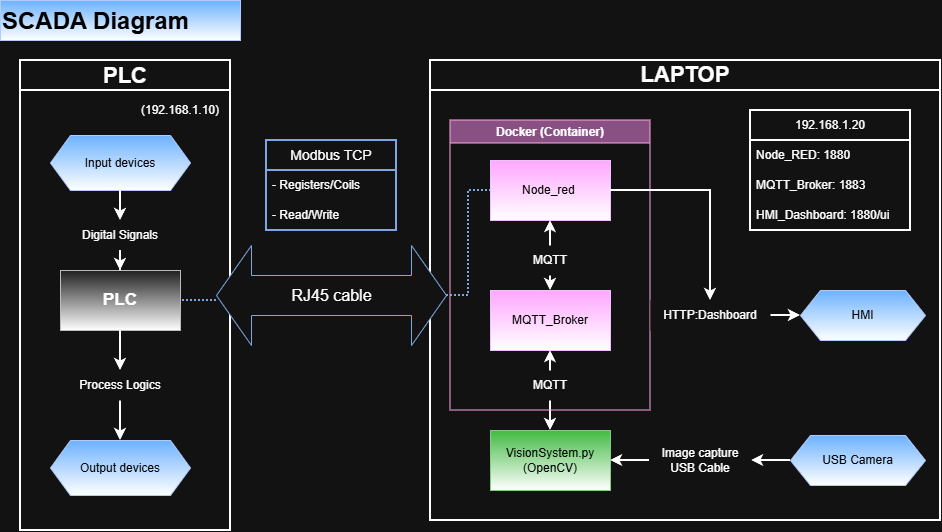
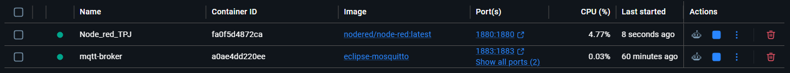

# SCADA Overview

---

| Component                         | Role                | Protocols Used | Description |
|----------------------------------|---------------------|----------------|-------------|
| **Click PLC CPU (192.168.1.10)** | Control Unit        | Modbus TCP     | Executes pre-defined logic to manage the process. Continuously monitors and updates internal variables (memory/registers), which can be accessed by external systems. |
| **Node-RED Data Hub (192.168.1.20)** | Data Integration Hub | Modbus TCP, MQTT | Connects different protocols and devices, enabling data flow between the PLC, MQTT broker, and other system components. |

## Communication Protocols
- **Modbus TCP**: Enables communication between the PLC and Node-RED over an RJ45 Ethernet connection.  
- **MQTT**: Enables publish/subscribe communication between the Python vision script and Node-RED.
---
## Deployment Environment

- Node-RED and the MQTT broker are deployed as containers using Docker Desktop.  
- Running them in containers simplifies network setup and provides isolation between services.  
- Containerized deployment is easy to manage, lightweight, and ensures a consistent runtime environment.
---
## Core Services

### a) MQTT Broker (Port 1883)
- Handles publish/subscribe messaging  
- Enables data exchange between Node-RED and other components (e.g., vision system)  

### b) VisionSystem.py (OpenCV)
- Captures images from a USB camera when triggered  
- Processes the image (grayscale, filtering, template matching)  
- Identifies the rank and suit from a predefined template set  
- Publishes the result to the MQTT broker  

---