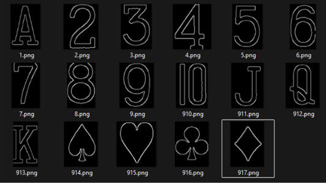

# SCADA Overview

---
### 1. Main Components
| Component                      | Role              | Protocols Used                              | Description |
|--------------------------------|-------------------|---------------------------------------------|-------------|
| **PLC CPU (192.168.1.10)**     | Control Unit      | Modbus TCP (Server)                         | Executes pre-defined logic to manage the process. Continuously monitors and updates internal variables (coils/registers). |
| **Node-RED (192.168.1.20)**    | Data Integration  | Modbus TCP (Client), MQTT (Vision System)   | Connects different protocols and devices, enabling data flow between the PLC, MQTT broker, and other system components. |

---
### 2. Deployment Environment
|  |
|----------------------------------------------------|

| Container                              | Role                | Port |
|----------------------------------------|---------------------|------|
| **Node-RED (192.168.1.20)**            | Data Hub / HMI      | 1880 |
| **MQTT Broker (192.168.1.20)**         | Message Broker      | 1883 |

#### Notes
- Node-RED and the MQTT broker are deployed as containers using Docker Desktop.  
- Running them in containers simplifies network setup and provides isolation between services.  
- Containerized deployment is easy to manage, lightweight, and ensures a consistent runtime environment.  

---
### 3. VisionSystem.py (OpenCV)
||
|----------------------------------------------------|
- An OpenCV python script that is used for card identification logic.
- It Captures images from a USB camera when triggered  
- Processes the image (grayscale, filtering, template matching)  
- Identifies the rank and suit from a predefined template set  
- Publishes the result to the MQTT broker  

---