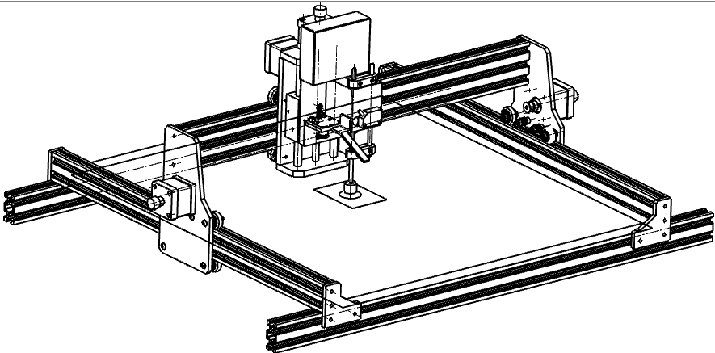
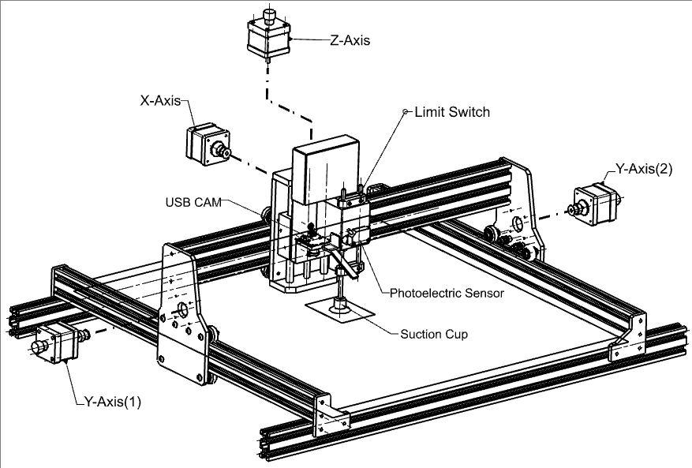
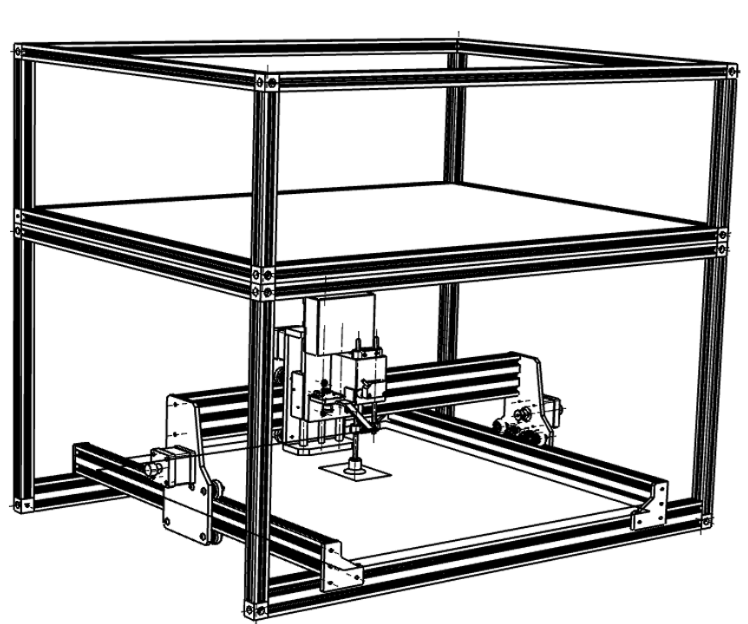
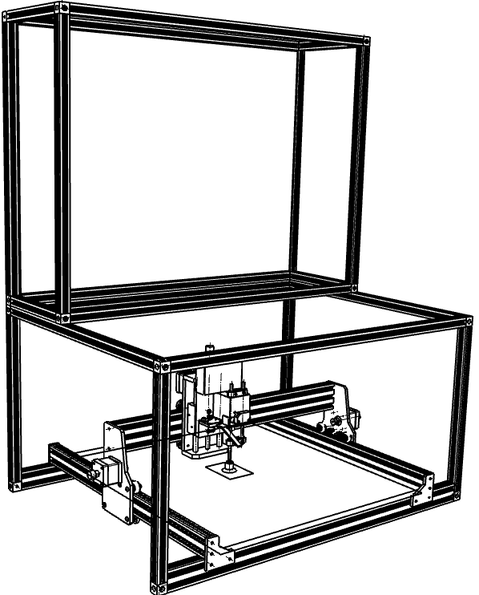

# Hardware Overview

## 3-Axis Gantry

    

##Key Components

| Component | Description | Function |
|-----------|-------------|----------|
| **X-Axis** | Horizontal gantry carriage with stepper motor | Left-right motion control |
| **Y-Axis (1)** | Left-side rail motor assembly | Front-back motion (dual motor synchronization) |
| **Y-Axis (2)** | Right-side rail motor assembly | Front-back motion (dual motor synchronization) |
| **Z-Axis** | Vertical spindle/tool carriage | Up-down motion control |
| **USB CAM** | Integrated camera module | Visual positioning and alignment |
| **Limit Switch** | End-stop position sensor | Axis homing and travel limits |
| **Photoelectric Sensor** | Workpiece detection/homing | Z-axis probing and workpiece detection |
| **Suction Cup** | Workpiece holding fixture | Part retention during operations |

---

## Enclosure Configurations

| Configuration | Image | Description |
|---------------|-------|-------------|
| **Transportation Mode** |  | Two-tier collapsible enclosure designed for compact storage or transport. The folding mechanism allows the top frame to be mounted on the base frame with t-nut screws. |
| **Operational Mode** |  | Standard vertical enclosure configuration providing full working structure with easy of access to control panel. |

---
